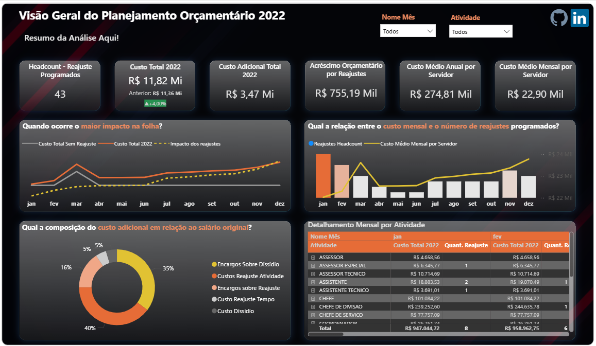
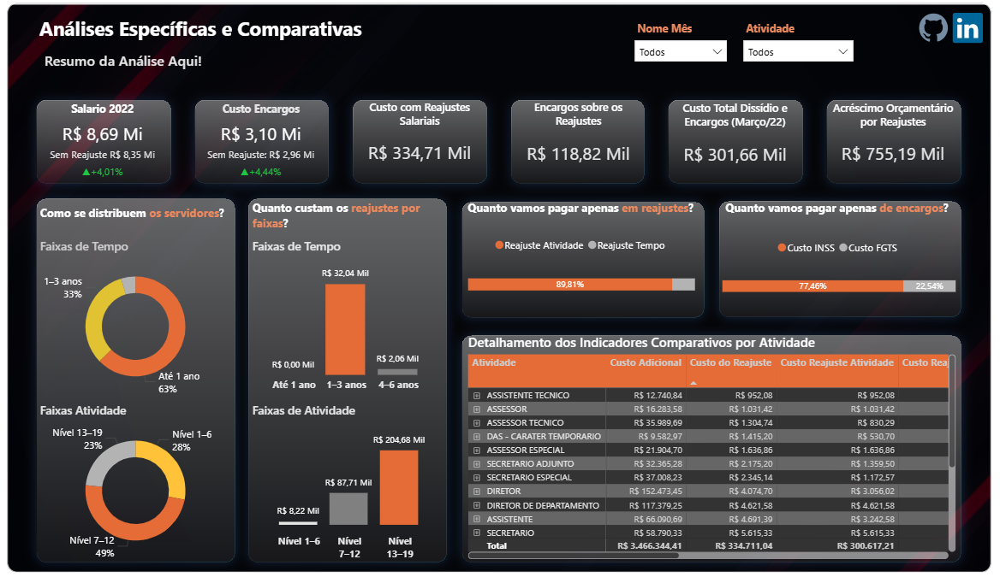

# 📊 Planejamento Orçamentário de Pessoal – Desafio Técnico BI

Este repositório contém a solução desenvolvida para o desafio técnico com foco em planejamento orçamentário de pessoal, análise de custos e criação de dashboard analítico.

## 🎯 Objetivo do Desafio

Simular o planejamento orçamentário anual de pessoal da empresa com base em dados de servidores, aplicando regras específicas de **reajuste salarial**, **dissídio coletivo** e **encargos trabalhistas**, além de gerar **insights acionáveis** para a diretoria.

---

## 🧩 Etapas Realizadas

### 🔧 1. Tratamento e Enriquecimento de Dados
- Limpeza de dados inconsistentes ou incompletos
- Cruzamento entre bases utilizando `PROCV` e manipulações via Power Query
- Cálculo do salário com base em faixas salariais
- Enriquecimento com data de admissão, data de último reajuste, tipo de atividade e tempo de casa

### 📈 2. Regras de Negócio Aplicadas
- **Reajuste por tempo de casa** e **atividade**
- Programação do reajuste por competência (admissão ou último reajuste)
- Aplicação de **encargos trabalhistas** (INSS 27,5% e FGTS 8%)
- Reajuste adicional de **5% de dissídio** aplicado no mês de março/2022

### 📊 3. Projeção Orçamentária
- Simulação de salários corrigidos mês a mês
- Estimativa do custo mensal e acumulado por servidor
- Cálculo de custo total com e sem reajustes

### 📉 4. Análise e Visualização no Power BI
- Dashboard com foco em **tomada de decisão**
- Indicadores de:
  - Custo total e adicional
  - Impacto de cada política de reajuste
  - Custo por tipo de encargo (INSS, FGTS, dissídio)
  - Headcount com reajuste por mês
  - Custo médio mensal por servidor

---
### [Link Apresentação Slide](https://1drv.ms/p/c/57f9f846065ef253/Eeeo2CcdEoVJjLwQa0eGZjEBgYbWCg3fhBluVvLPGakklg?e=bfKEAr)
### [Link do Dashboard Aqui](https://app.powerbi.com/view?r=eyJrIjoiOWI0MjkwYjItNzUzMC00MWM4LWJmYjAtYmRiYWQ2NDljY2I0IiwidCI6IjcxNTU4ZjkxLWU4ZDAtNDcyYS1hM2Q2LTljOWQ2Y2RkZDU1YSJ9)

<h3>Visão Geral</h3>

<h3>Análises Específicas</h3>

---

## 💡 Principais Insights

- O custo total projetado com pessoal foi de **R$ 11.816.957**.
- O custo adicional devido aos reajustes, encargos e dissídio foi de **R$ 755 mil**, representando **um aumento de 4%** no orçamento.
- O **reajuste por atividade** concentrou a maior parte do custo adicional.
- Em março, o dissídio coletivo representou um impacto isolado de **R$ 301 mil**.
- A faixa de servidores de nível **13–19** concentrou **68% do custo com política de atividade**.

---

## 🚀 Tecnologias Utilizadas

- **Excel Online** – Limpeza e tratamento inicial dos dados
- **Power BI** – Modelagem tabular e criação de medidas DAX
- **DAX (Data Analysis Expressions)** – Cálculos orçamentários e KPIs
- **GitHub** – Documentação e portfólio

---

## 🙋‍♀️ Sobre Mim

Sou Thayla Oliveira, analista de dados com foco em transformar dados em decisões estratégicas.  
Este projeto representa meu compromisso com **análise crítica**, **modelagem de dados** e **storytelling com impacto**.

🔗 [LinkedIn](https://www.linkedin.com/in/thayla-oliveira/) | 📧 thaylathais1@gmail.com

---

## ✅ Status: **Concluído**
